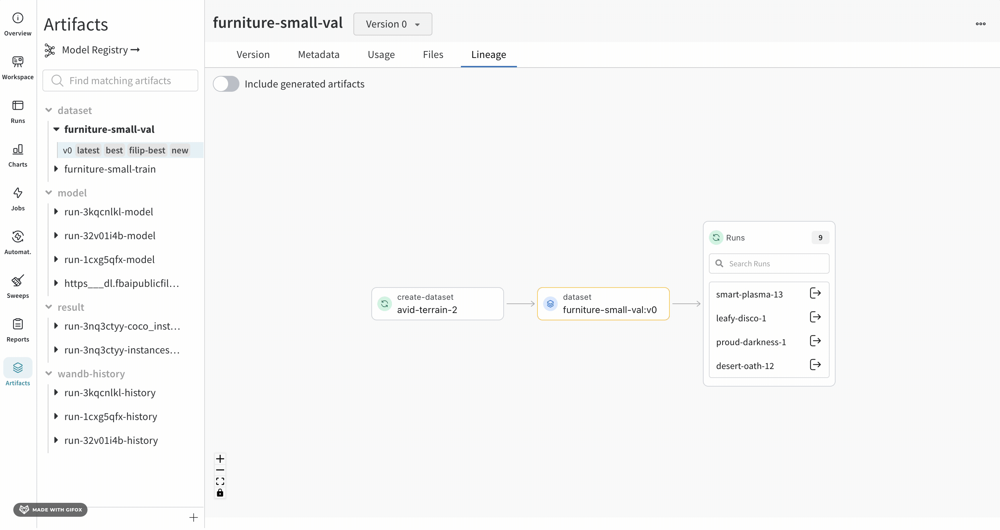

# Explore and traverse artifact graphs

<head>
    <title>Explore direct acyclic W&B Artifact graphs.</title>
</head>

W&B automatically tracks the artifacts a given run logged as well as the artifacts a given run used. These artifacts can include datasets, models, evaluation results, or more. You can explore an artifact's lineage to track and manage of the various artifacts produced throughout the machine learning lifecycle.


## Lineage
Tracking an artifact's lineage has several key benefits:

- Reproducibility: By tracking the lineage of all artifacts, teams can reproduce experiments, models, and results, which is essential for debugging, experimentation, and validating machine learning models.

- Version Control: Artifact lineage involves versioning of artifacts so that changes are tracked over time. This allows teams to roll back to previous versions of data, code, or models if needed.

- Auditing: Having a detailed history of the artifacts and their transformations enables organizations to comply with regulatory and governance requirements.

- Collaboration and Knowledge Sharing: Artifact lineage facilitates better collaboration among team members by providing a clear record of what has been tried, what worked, and what didn’t. This helps in avoiding duplication of efforts and accelerates the development process.

### Finding an artifact's lineage
When selecting an artifact in the **Artifacts** tab, you can see your artifact's lineage. This graph view shows a general overview of your pipeline. 

To view an artifact graph:

1. Navigate to your project in the W&B App UI
2. Choose the artifact icon on the left panel.
3. Select **Lineage**.


### Navigating the lineage graph

The artifact or run type you provide is located above its name, with artifacts represented by blue icons and runs represented by green icons. The input and output of a run or artifact is depicted in the graph with arrows. 

:::info
You can view the type and the name of artifact in both the left sidebar and in the **Lineage** tab. 
:::


For a more detailed view, click any individual artifact or run to get more information on a particular object.



### Artifact clusters

When a level of the graph has five or more runs or artifacts, it creates a cluster. A cluster has a search bar to find specific versions of runs or artifacts and pulls an individual node from a cluster to continue investigating the lineage of a node inside a cluster. 


Clicking on a node opens a preview with an overview of the node. Clicking on the arrow extracts the individual run or artifact so you can examine the lineage of the extracted node.


## Use the API to track lineage
You can also navigate a graph using the [W&B API](../../ref/python/public-api/api.md). 

Create an artifact object. First, create a run with `wandb.init`. Then,create a new artifact or retrieve an existing one with `wandb.Artifact`. Next, add files to the artifact with `.add_file`. Finally, log the artifact to the run with `.log_artifact`. The finished code looks something like this:

```python
with wandb.init() as run:
    artifact = wandb.Artifact("artifact_name", "artifact_type")

    # Add Files and Assets to the artifact using
    # `.add`, `.add_file`, `.add_dir`, and `.add_reference`
    artifact.add_file("image1.png")
    run.log_artifact(artifact)
```

Use the artifact object's [`logged_by`](../../ref/python/artifact.md#logged_by) and [`used_by`](../../ref/python/artifact.md#used_by) methods to walk the graph from the artifact:

```python
# Walk up and down the graph from an artifact:
producer_run = artifact.logged_by()
consumer_runs = artifact.used_by()
```
## Next steps
- [Explore artifacts in more detail](../artifacts/artifacts-walkthrough.md)
- [Manage artifact storage](../artifacts/delete-artifacts.md)